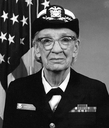
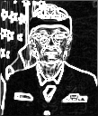

# Single-Cycle RISC-V Microarchitecture

A fully functional **single-cycle RV32I processor** implemented in Verilog HDL — designed, verified, and validated by running a real image processing application on it.


---

## What This Project Does

This is a complete RV32I CPU built from scratch in Verilog. Every module — ALU, register file, control unit, branch unit, immediate generator, memory — was written and verified individually, then integrated into a working processor.

To prove it actually works, a C program implementing **RGB→grayscale conversion and Sobel edge detection** was compiled with `riscv64-unknown-elf-gcc` and executed on the CPU in simulation. The processor ran for **1,038,659 clock cycles** and produced correct output on a real photograph.

### Results — Grace Hopper photograph (109×128 pixels)

| Original | Grayscale | Sobel Edges |
|----------|-----------|-------------|
|  |  |  |

---

## ISA Coverage

### Base (designed from scratch)
| Type | Instructions |
|------|-------------|
| R-type | ADD, SUB, AND, OR, XOR, SLL, SRL, SRA, SLT, SLTU |
| I-type | ADDI, ANDI, ORI, XORI, SLTI, SLTIU, SLLI, SRLI, SRAI |
| S-type | SW |
| Load | LW |
| B-type | BEQ, BNE, BLT, BGE, BLTU, BGEU |

### Extended (added to support compiled C)
| Type | Instructions | Why needed |
|------|-------------|------------|
| J-type | JAL | Every function call gcc generates |
| I-type | JALR | Function returns, indirect calls |
| U-type | LUI, AUIPC | Loading 32-bit constants and addresses |

Without JAL/JALR, no gcc-compiled program can execute — every `call` and `return` fails silently.

---

## Project Structure

```
├── modules/               RTL source
│   ├── riscv_cpu.v        Top-level CPU (updated)
│   ├── control_unit.v     Control signals (updated: +JAL/JALR/LUI/AUIPC)
│   ├── imm_gen.v          Immediate decoder (updated: +J-type, U-type)
│   ├── instr_mem.v        Instruction memory — loads from program.hex
│   ├── data_mem.v         Data memory — 256KB, loads from image_in.hex
│   ├── ALU.v              32-bit ALU
│   ├── ALUControl.v       ALU control decoder
│   ├── branch_unit.v      Branch condition evaluator
│   ├── regfile.v          32×32 register file
│   └── pc_reg.v           Program counter
│
├── testbenches/           Per-module + integration testbenches
│
├── sw/                    Image processing C program
│   ├── imgproc.c          RGB→grayscale + Sobel edge detection
│   ├── mulsi3.c           Software multiply (RV32I has no MUL)
│   ├── start.s            Startup: init stack pointer, call main
│   ├── link.ld            Linker script (_start at 0x0, no stdlib)
│   └── program.hex        Compiled binary ready to load
│
├── scripts/
│   ├── img_to_hex.py      Convert any JPG/PNG → image_in.hex
│   └── hex_to_img.py      CPU memory dump → original/grayscale/edges PNGs
│
├── sim/
│   ├── tb_imgproc.v       Image processing testbench (iverilog + ModelSim)
│   ├── run_sim.do         ModelSim do script
│   └── program.hex        Compiled binary (copy of sw/program.hex)
│
└── results/               Output images from simulation
    ├── original.png
    ├── grayscale.png
    └── edges.png
```

---

## Memory Map

| Address | Contents |
|---------|----------|
| `0x00000` | Image width W |
| `0x00004` | Image height H |
| `0x00008 + i×4` | Input pixel i as `0x00RRGGBB` |
| `0x10000 + i×4` | Grayscale output (CPU writes, Pass 1) |
| `0x20000 + i×4` | Sobel edge output (CPU writes, Pass 2) |
| `0x30000` | Stack top (grows downward) |

---

## Run It Yourself

### Requirements
```bash
# WSL Ubuntu / Linux
sudo apt install -y gcc-riscv64-unknown-elf iverilog
pip install Pillow numpy
```

### Step 1 — Convert your image
```bash
python3 scripts/img_to_hex.py your_photo.jpg 128
cp image_in.hex image_meta.txt sim/
```

### Step 2 — Simulate
```bash
cd sim/

iverilog -o run_cpu tb_imgproc.v \
  ../modules/riscv_cpu.v ../modules/control_unit.v \
  ../modules/imm_gen.v   ../modules/instr_mem.v \
  ../modules/data_mem.v  ../modules/ALU.v \
  ../modules/ALUControl.v ../modules/branch_unit.v \
  ../modules/regfile.v   ../modules/pc_reg.v

./run_cpu
# Prints cycle count, writes image_out.hex when CPU halts
```

### Step 3 — Reconstruct output images
```bash
python3 ../scripts/hex_to_img.py image_out.hex image_meta.txt
# Creates original.png, grayscale.png, edges.png
```

### ModelSim
```
File > Change Directory → sim/
do run_sim.do
```

---

## Algorithms

**Pass 1 — RGB → Grayscale**
```
Y = (77×R + 150×G + 29×B) >> 8
```
Fixed-point approximation of the standard luminance formula. No division, no floating point. All multiplies compile to shift+add chains on RV32I.

**Pass 2 — Sobel Edge Detection**
```
Gx = [-1  0 +1]     Gy = [-1 -2 -1]
     [-2  0 +2]          [ 0  0  0]
     [-1  0 +1]          [+1 +2 +1]

magnitude = clamp(|Gx| + |Gy|, 0, 255)
```
3×3 convolution kernel. L1 norm avoids square root. Runs entirely in RV32I integer instructions.

---

## Recompile the Program

```bash
cd sw/

riscv64-unknown-elf-gcc \
  -march=rv32i -mabi=ilp32 -O1 \
  -ffreestanding -nostdlib -nostartfiles \
  -T link.ld -o imgproc.elf \
  start.s imgproc.c mulsi3.c

riscv64-unknown-elf-objcopy -O binary imgproc.elf imgproc.bin

python3 -c "
data = open('imgproc.bin','rb').read()
while len(data)%4: data+=b'\x00'
words = [int.from_bytes(data[i:i+4],'little') for i in range(0,len(data),4)]
with open('program.hex','w') as f:
    for w in words: f.write(f'{w:08x}\n')
    for _ in range(16384-len(words)): f.write('00000013\n')
print(f'{len(words)} instructions compiled')
"

cp program.hex ../sim/program.hex
```

---

## What Was Modified to Support Compiled C

| Module | Change |
|--------|--------|
| `control_unit.v` | Added JAL (0x6f), JALR (0x67), LUI (0x37), AUIPC (0x17) opcodes |
| `imm_gen.v` | Added J-type immediate decode; widened `imm_src` from 2-bit to 3-bit |
| `riscv_cpu.v` | Added JALR target `(rs1+imm)&~1`; extended write-back mux for LUI/AUIPC/JAL |
| `instr_mem.v` | Changed from hardcoded values to `$readmemh("program.hex")` |
| `data_mem.v` | Changed to `$readmemh("image_in.hex")`, expanded to 256KB |

All original 5 modules (ALU, ALUControl, branch_unit, regfile, pc_reg) are **unchanged**.

---

## Future Work
- 5-stage pipeline with hazard detection and data forwarding
- RV32IM extension (hardware multiply/divide)
- Instruction and data cache
- FPGA synthesis and timing closure

---

## Author
Yokesh Ganesh Babu

Licensed under the [MIT License](LICENSE)
